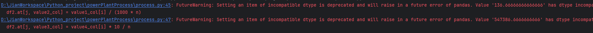
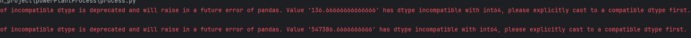
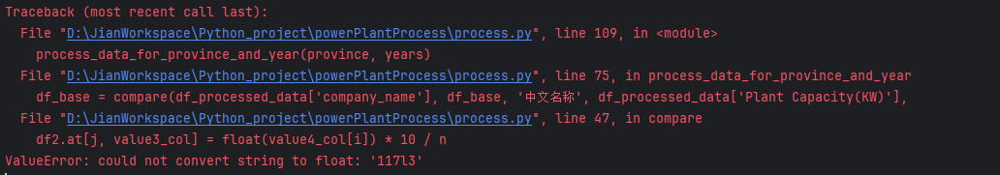

## 错误记录

### 1.数据类型异常报错

错误：

```
D:\JianWorkspace\Python_project\powerPlantProcess\process.py:45: FutureWarning: Setting an item of incompatible dtype is deprecated and will raise in a future error of pandas. Value '136.66666666666666' has dtype incompatible with int64, please explicitly cast to a compatible dtype first.
  df2.at[j, value2_col] = value1_col[i] / (1000 * n)
D:\JianWorkspace\Python_project\powerPlantProcess\process.py:47: FutureWarning: Setting an item of incompatible dtype is deprecated and will raise in a future error of pandas. Value '547386.6666666666' has dtype incompatible with int64, please explicitly cast to a compatible dtype first.
  df2.at[j, value3_col] = value4_col[i] * 10 / n
```






解决：

```
df2.at[j, value2_col] = float(value1_col[i]) / (1000 * n)
df2.at[j, value3_col] = float(value4_col[i]) * 10 / n
```


### 2.OCR识别错误

e.g.

```
Traceback (most recent call last):
  File "D:\JianWorkspace\Python_project\powerPlantProcess\process.py", line 109, in <module>
    process_data_for_province_and_year(province, years)
  File "D:\JianWorkspace\Python_project\powerPlantProcess\process.py", line 75, in process_data_for_province_and_year
    df_base = compare(df_processed_data['company_name'], df_base, '中文名称', df_processed_data['Plant Capacity(KW)'],
  File "D:\JianWorkspace\Python_project\powerPlantProcess\process.py", line 47, in compare
    df2.at[j, value3_col] = float(value4_col[i]) * 10 / n
ValueError: could not convert string to float: '117l3'
```

```
ValueError: could not convert string to float: '1802g'
```



解决：

目前少量可以手动修改正确，但是如果此类情况过多的话，需考虑修改代码对异常字符串进行处理
